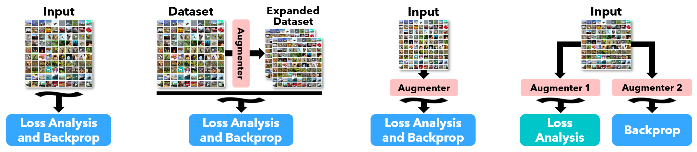

<<<<<<< HEAD
# ML-Reproducibility-Challenge-2021
Submission for the "Augmentation Strategies for Learning with Noisy Labels" paper published in ICLR 2021.
=======
# Augmentation-for-LNL

[](https://paperswithcode.com/sota/image-classification-on-clothing1m?p=augmentation-strategies-for-learning-with)

Code for ***Augmentation Strategies for Learning with Noisy Labels*** (CVPR 2021) forked from the original repository.

**[Authors](mailto:kento24gs@outlook.com,yding@cs.ucsb.edu,anrich@cs.ucsb.edu,holl@cs.ucsb.edu)**: [Kento Nishi](mailto:kento24gs@outlook.com)\*, [Yi Ding](mailto:yding@cs.ucsb.edu)\*, [Alex Rich](mailto:anrich@cs.ucsb.edu), [Tobias Höllerer](mailto:holl@cs.ucsb.edu) [`*`: [equal contribution](mailto:kento24gs@outlook.com,yding@cs.ucsb.edu)]

<summary>Introduction</summary>
Data augmentation is common technique that many methods use due to its ability to expand and generalize the existing datasets. There are data augmentation methods that needs to be set by the developers and some are includes learnable augmentation algorithms that can extract prior information from the dataset and set the augmentation strategy. Whether it is learnable or static augmentations, it is proven that implementing data augmentation methods into network training will increase the performance and overall generalizability of the networks. 

Even though data augmentation is a popular research area, there are only few works covering it on the learning with noisy labels area (LNL). The works covering the data augmentation on LNL uses only weak augmentations, like random crop and flip. However, there are no work on stronger augmentations, like sheering and rotation, on LNL yet. In this paper, the main objective is to implement strong augmentation strategies into existing training algorithms to improve the generalizability and robustness of the systems.


<p align="center">
    
</p>

[View on arXiv](https://arxiv.org/abs/2103.02130) / [View PDF](https://arxiv.org/pdf/2103.02130.pdf) / [Download Paper Source](https://arxiv.org/e-print/2103.02130) / [Download Source Code](https://github.com/KentoNishi/Augmentation-for-LNL/archive/master.zip)

## Benchmarks

<h3>CIFAR-10</h3>
<style type="text/css">
.tg  {border-collapse:collapse;border-spacing:0;}
.tg td{border-color:black;border-style:solid;border-width:1px;font-family:Arial, sans-serif;font-size:14px;
  overflow:hidden;padding:10px 5px;word-break:normal;}
.tg th{border-color:black;border-style:solid;border-width:1px;font-family:Arial, sans-serif;font-size:14px;
  font-weight:normal;overflow:hidden;padding:10px 5px;word-break:normal;}
.tg .tg-bobw{font-weight:bold;text-align:center;vertical-align:bottom}
.tg .tg-wa1i{font-weight:bold;text-align:center;vertical-align:middle}
.tg .tg-nrix{text-align:center;vertical-align:middle}
.tg .tg-7zrl{text-align:left;vertical-align:bottom}
.tg .tg-8d8j{text-align:center;vertical-align:bottom}
</style>
<table class="tg">
<thead>
  <tr>
    <th class="tg-wa1i" rowspan="2">Type</th>
    <th class="tg-wa1i" rowspan="2">Method/Noise</th>
    <th class="tg-bobw" colspan="4">CIFAR-10</th>
  </tr>
  <tr>
    <th class="tg-bobw">20%</th>
    <th class="tg-bobw">50%</th>
    <th class="tg-bobw">80%</th>
    <th class="tg-bobw">90%</th>
  </tr>
</thead>
<tbody>
  <tr>
    <td class="tg-nrix" rowspan="2">Own</td>
    <td class="tg-7zrl">AugDesc-SS</td>
    <td class="tg-8d8j">87,18</td>
    <td class="tg-8d8j">-</td>
    <td class="tg-8d8j">-</td>
    <td class="tg-8d8j">42</td>
  </tr>
  <tr>
    <td class="tg-7zrl">AugDesc-WS</td>
    <td class="tg-8d8j">87,57</td>
    <td class="tg-8d8j">84,28</td>
    <td class="tg-8d8j">69,92</td>
    <td class="tg-8d8j">43,8</td>
  </tr>
  <tr>
    <td class="tg-nrix" rowspan="2">Paper</td>
    <td class="tg-7zrl">AugDesc-SS</td>
    <td class="tg-8d8j">96,47</td>
    <td class="tg-8d8j">-</td>
    <td class="tg-8d8j">-</td>
    <td class="tg-8d8j">81,77</td>
  </tr>
  <tr>
    <td class="tg-7zrl">AugDesc-WS</td>
    <td class="tg-8d8j">96,35</td>
    <td class="tg-8d8j">95,64</td>
    <td class="tg-8d8j">93,72</td>
    <td class="tg-8d8j">35,33</td>
  </tr>
</tbody>
</table>

<h3>CIFAR-100</h3>

## Training Locally

> The source code is heavily reliant on CUDA. Please make sure that you have the newest version of Pytorch and a compatible version of CUDA installed. Using older versions may exhibit inconsistent performance.
>
> [Download Pytorch](https://pytorch.org/get-started/locally/)
> /
> [Download CUDA](https://developer.nvidia.com/cuda-downloads)
>
> Other requirements are included in `requirements.txt`.


> **Reproducibility**
> 
> At particularly high noise ratios (ex. 90% on CIFAR-10), results may vary across training runs.
> We are aware of this issue, and are exploring ways to yield more consistent results.
> We will publish any findings (consistently performant configurations, improved procedures, etc.) both in this repository and in continutations of this work.

All training configurations and parameters are controlled via the `presets.json` file. Configurations can contain infinite subconfigurations, and settings specified in subconfigurations always override the parent.

To train locally, first add your local machine to the `presets.json`:
```javascript
{
    // ... inside the root scope
    "machines": { // list of machines
        "localPC": { // name for your local PC, can be anything
            "checkpoint_path": "./localPC_checkpoints"
        }
    },
    "configs": {
        "c10": { // cifar-10 dataset
            "machines": { // list of machines
                "localPC": { // local PC name
                    "data_path": "/path/to/your/dataset"
                    // path to dataset (python) downloaded from:
                    // https://www.cs.toronto.edu/~kriz/cifar.html
                }
                // ... keep all other machines unchanged
            }
            // ... keep all other config values unchanged
        }
        // ... keep all other configs unchanged
    }
    // ... keep all other global values unchanged
}
```

A "preset" is a specific configuration branch. For example, if you would like to run `train_cifar.py` with the preset  `root -> c100 -> 90sym -> AugDesc-WS` on your machine named `localPC`, you can run the following command:
```bash
python train_cifar.py --preset c100.90sym.AugDesc-WS --machine localPC
```
The script will begin training the preset specified by the `--preset` argument. Progress will be saved in the appropriate directory in your specified `checkpoint_path`. Additionally, if the `--machine` flag is ommitted, the training script will look for the dataset in the `data_path` inherited from parent configurations.

Here are some abbreviations used in our `presets.json`:
| Abbreviation | Meaning                   |
| :----------- | :------------------------ |
| `c10`        | CIFAR-10                  |
| `c100`       | CIFAR-100                 |
| `c1m`        | Clothing1M                |
| `sym`        | Symmetric Noise           |
| `asym`       | Asymmetric Noise          |
| `SAW`        | Strongly Augmented Warmup |
| `WAW`        | Weakly Augmented Warmup   |
| `RandAug`    | RandAugment               |


## Citations
Please cite the following:
```
@InProceedings{Nishi_2021_CVPR,
    author    = {Nishi, Kento and Ding, Yi and Rich, Alex and {H{\"o}llerer, Tobias},
    title     = {Augmentation Strategies for Learning With Noisy Labels},
    booktitle = {Proceedings of the IEEE/CVF Conference on Computer Vision and Pattern Recognition (CVPR)},
    month     = {June},
    year      = {2021},
    pages     = {8022-8031}
}
```

## Extras

Extra bits of unsanitized code for plotting, training, etc. can be found in the [Aug-for-LNL-Extras repository](https://github.com/KentoNishi/Aug-for-LNL-Extras).

## Additional Info
This repository is a fork of [the official DivideMix implementation](https://github.com/LiJunnan1992/DivideMix).
>>>>>>> reproduce_local
